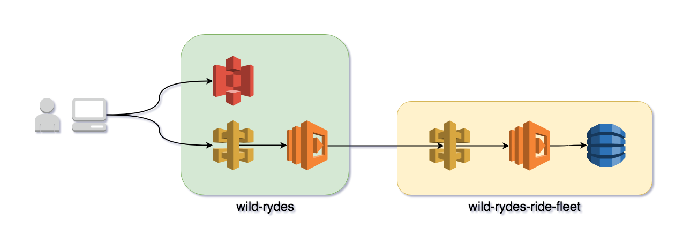

# Serverless Up And Running

This workshop demonstrates a typical 3 tier serverless application. It also introduces participants to the basics of managing serverless applications with [Serverless Framework](https://www.serverless.com). The workshop walks the participant through the first steps of creating and managing serverless applications. After the workshop the participant should feel confident and be capable of creating their own serverless application.

The modules in this workshop are:

1) [Getting Started](./01-getting-started/README.md)
1) [Serverless Microservices](./02-microservices/README.md)
1) [Building A Serverless Service](./03-build-new-service/README.md)

## Tech Stack

Wild Rydes is the application we'll be working in the workshop. It is a ride sharing application that allows a user to select a pickup point, request a ride, and the service will return a unicorn to pick up the requester.

Wild Rydes is built using an AWS serverless microservice architecture.  The language of choice for our services is Python.  Our application stack uses the following AWS services:

* [S3](https://aws.amazon.com/s3/)
  * Wild Rydes front end.
  * Hosts static web resources including HTML, CSS, JavaScript, and image files.
  * Makes calls to backend to dispatch rides.
* [API Gateway](https://aws.amazon.com/api-gateway/)
  * Provides backend interface.
  * Each backend endpoint invokes a Lambda function.
* [Lambda](https://aws.amazon.com/lambda/)
  * Serverless compute layer.
  * Responsible for managing the ride fleet.
* [DynamoDB](https://aws.amazon.com/dynamodb/)
  * Handles persistent data.
  * Records rides.

Our tech stack is as follows.

* [wild-rydes-website](https://github.com/ServerlessOpsIO/wild-rydes-website)
  * Front end website
* [wild-rydes-ride-requests](https://github.com/ServerlessOpsIO/wild-rydes-ride-requests)
  * Ride request backend
* [wild-rydes-ride-fleet](https://github.com/ServerlessOpsIO/wild-rydes-ride-fleet)
  * Ride fleet management

